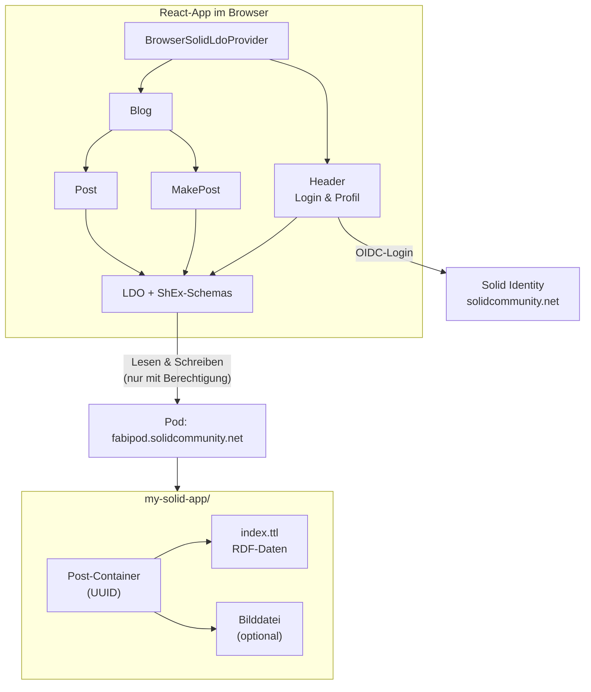

Ich habe gerade _This Is for Everyone_ von Tim Berners-Lee beendet – das Buch,
in dem der Erfinder des World Wide Web darüber nachdenkt, wohin das Web sich
entwickelt hat und wohin es eigentlich hätte gehen sollen. Vieles darin ist
bekanntes Terrain: die zunehmende Zentralisierung, die Macht der großen
Plattformen, die Frage, ob das Internet noch dem dient, wofür es gedacht war.
Aber eine Idee hat mich besonders gepackt – obwohl sie schon seit Jahren
existiert, hatte ich bis dahin noch nie davon gehört.

Es geht um [Solid](https://solidproject.org/){:target="_blank"}.

## Das Problem

Berners-Lee formuliert im Kern etwas, das viele von uns intuitiv spüren, aber
selten so klar aussprechen: Daten sollten jedem selbst gehören, nicht den
Konzernen.

Das klingt nach einem simplen Prinzip. In der Praxis sieht es anders aus. Unsere
Fitnessdaten liegen beim Tracker-Hersteller. Unsere Fotos beim Cloud-Anbieter.
Unsere Kontakte im Adressbuch einer Plattform, die wir vielleicht morgen gar
nicht mehr nutzen wollen. Und wenn wir wechseln? Dann fangen wir bei null an.

Für Berners-Lee reicht es nicht, dass einem die Daten formal gehören.
Entscheidend ist, dass man sie gezielt und ohne großen Aufwand anderen
zugänglich machen kann – etwa Fitnessdaten an ein Krankenhaus, Kontaktdaten an
einen neuen Messenger, Profilinformationen an ein soziales Netzwerk. Und dass
man sie leicht von einem Anbieter zum anderen umziehen kann, ohne alles manuell
exportieren und neu importieren zu müssen.

Ein Beispiel aus meinem Alltag: Bei manchen Fitnesstrackern muss man bezahlen,
nur um Fitnessdaten anzuzeigen, die älter als ein Jahr sind. Daten, die ich
selbst erzeugt habe, auf meinem eigenen Gerät. Das finde ich skandalös – und es
ist symptomatisch für ein System, in dem der Nutzer nicht Eigentümer, sondern
Mieter seiner eigenen Informationen ist.

## Die Idee: Pods

Solid – kurz für _Social Linked Data_ – ist Berners-Lees Antwort auf dieses
Problem. Im Zentrum stehen sogenannte Pods (_Personal Online Datastores_):
persönliche Online-Datenspeicher, die dir gehören und die du selbst
kontrollierst.

Ein Pod kann allerlei Informationen enthalten – Profildaten in einem Pod,
Gesundheitsinformationen in einem anderen, Blogposts in einem dritten.
Anwendungen, die von Solid authentifiziert werden, dürfen auf diese Daten
zugreifen, wenn du als Nutzer der Anwendung die Berechtigung erteilst. Nicht
mehr, nicht weniger.

Entscheidend dabei ist, dass ein Pod überall liegen kann: auf der lokalen
Festplatte, einem Firmenserver, dem eigenen Webspace oder bei einem
Cloud-Anbieter. Du entscheidest, wo deine Daten physisch gespeichert werden. Die
Anwendung, die du nutzt, hat keine eigene Datenbank mehr. Sie liest und
schreibt in deinem Pod.

Das Solid-Ökosystem lässt sich in drei Bausteine zerlegen:

1. _Solid Identity_ – eine universelle Anmeldung für das dezentrale Web. Statt
   für jede App ein neues Konto anzulegen, nutzt du deine Solid-Identität.
2. _Solid Pod_ – dein persönlicher Datenspeicher. Fotos, Kontakte, Blogposts –
   alles liegt hier, sicher und unter deiner Kontrolle.
3. _Solid App_ – die Anwendungen, die du nutzt. Der Unterschied: Sie haben keine
   eigene Datenbank, sondern arbeiten direkt mit deinem Pod.

Dieses Modell bedeutet, dass du mehrere Apps nutzen kannst, um dieselben Daten
zu verwalten, und Apps wechseln kannst, ohne deine Informationen zu verlieren.

## Ein Blick unter die Haube

Als Softwareentwickler wollte ich nachvollziehen, wie sich Solid in der Praxis
verhält – jenseits der Konzeptbeschreibung, direkt am Code. Grundlage dafür war
das Tutorial [Building Your First Solid App with LDO & React](https://dev.solidproject.org/guides/building_your_first_solid_app_with_ldo_and_react/){:target="_blank"}
der Solid-Entwicklerdokumentation. Es eignet sich gut, um die Architektur
schrittweise zu durchdringen und die Abstraktionen des Ökosystems an einem
konkreten Beispiel zu verstehen.

Damit verschiedene Anwendungen dieselben Daten interpretieren können, baut Solid
auf dem _Resource Description Framework_ (RDF) auf – einem Standard, mit dem
sich Entitäten und ihre Beziehungen zueinander formal beschreiben lassen. Die
direkte Arbeit mit RDF ist jedoch aufwendig. Im Tutorial übernimmt daher LDO
(_Linked Data Objects_) die Vermittlung: Die Bibliothek stellt Pod-Daten als
typisierte JavaScript-Objekte bereit. Die Struktur dieser Daten wird über ShEx
(_Shape Expressions_) definiert – vergleichbar mit einem Schema, das festlegt,
welche Eigenschaften ein Blogpost oder ein Profil enthalten darf.

Wie die einzelnen Teile im Tutorial zusammenspielen, lässt sich so
zusammenfassen:

Die App hat keine eigene Datenbank. Beim Login authentifiziert sich der Nutzer
über seine Solid Identity, LDO übersetzt die ShEx-Schemas in JavaScript-Objekte
und alle Beiträge landen als RDF in einem eigenen Ordner auf dem Pod – jeder Post
in einem eigenen Container mit `index.ttl` und optional einem Bild.

Das Ergebnis meines Experiments ist eine simple Microblogging-App, die Notizen
und Fotos direkt in meinem Pod speichert. Die Daten liegen unter
[fabipod.solidcommunity.net](https://fabipod.solidcommunity.net/my-solid-app/269ebc6c-61d0-4c4d-91dd-ae959e167e9e/){:target="_blank"}
– sichtbar, abrufbar, und sie gehören mir. Nicht einer Plattform, die morgen
ihre Nutzungsbedingungen ändern könnte.

Was mich beim Durchklicken der Daten im Browser am meisten beeindruckt hat: Es
fühlt sich nicht futuristisch an. Es fühlt sich an wie das Web, das wir hätten
haben können – strukturiert, offen und unter der Kontrolle des Nutzers.

## Warum hat sich das noch nicht durchgesetzt?

Hier wird es unbequem. Denn trotz der Eleganz des Konzepts scheint es in freier
Wildbahn noch kaum echte Projekte zu geben, die Solid im großen Stil einsetzen.
Das ist wenig überraschend: Unternehmen, deren Geschäftsmodelle auf Datensilos
basieren, werden wenig Interesse an einer Technologie haben, die genau diese
Silos aufbrechen soll.

Solid kann sich meiner Meinung nach nur durchsetzen, wenn eine von zwei
Bedingungen erfüllt ist:

- staatliche Regulierung, die Datenportabilität und Nutzerkontrolle
vorschreibt, oder
- eine kritische Masse von Menschen, die der Ansicht sind, dass ihre Daten ihnen
gehören – und das auch einfordern.

Beides ist derzeit nicht in Sicht. Die großen Plattformen haben keinen Anreiz,
ihre mächtigste Ressource freiwillig abzugeben. Und die meisten Nutzer –
verständlicherweise – priorisieren Bequemlichkeit über Datenhoheit.

Außerdem bleibt eine wichtige Frage offen: Wie verhindert man, dass Dienste,
die auf einen Pod zugreifen dürfen, diese Daten trotzdem in ihren eigenen Silos
speichern? Die Berechtigung erteilt den Zugriff – aber nichts hindert eine App
daran, alles zu kopieren und intern weiterzuverwenden. Solid löst das Problem
der Speicherung, nicht zwingend das der Nutzung.

## Eine Chance im KI-Zeitalter?

Vielleicht verändert sich das im KI-Zeitalter. KI-Systeme sind besonders dann
leistungsstark, wenn sie möglichst viel über einen selbst wissen. Je mehr
Kontext, desto bessere Antworten. Das Problem: Dieser Kontext landet heute bei
OpenAI, Anthropic und Google – nicht bei dir.

Ich könnte mir vorstellen, dass Menschen zunehmend skeptisch werden, den großen
KI-Playern allzu viel Privates anzuvertrauen. Wenn dein persönliches
Wissensmodell in deinem eigenen Pod liegt und du entscheidest, welche KI darauf
zugreifen darf, wäre das ein fundamental anderer Vertrag zwischen Nutzer und
Technologie. Solid wäre dann nicht nur eine Speicherlösung, sondern die
Infrastruktur für souveräne KI-Nutzung.

Ob das reicht, um die kritische Masse zu erreichen? Ich weiß es nicht. Aber die
Logik ist überzeugend.

## Schlussgedanken

Solid ist keine neue Idee. Berners-Lee arbeitet seit Jahren daran. Die
Technologie existiert, Tutorials sind verfügbar, Community-Pods wie
[solidcommunity.net](https://solidcommunity.net/){:target="_blank"}
laufen. Was fehlt, ist nicht das Wie, sondern das Warum – oder genauer:
ein breites gesellschaftliches Bewusstsein dafür, dass es ein Problem gibt, das
gelöst werden muss.

Ich bin kein Solid-Evangelist. Ich weiß nicht, ob sich das Projekt jemals
durchsetzen wird. Aber nach dem Lesen von Berners-Lees Buch und dem Bauen
meiner ersten Solid-App habe ich das Gefühl, eine der spannendsten Web-Ideen
kennengelernt zu haben. Eine Idee, die älter ist als die meisten Plattformen,
die heute unseren Alltag dominieren – und die uns die Frage stellt, ob wir im
Netz weiterhin nur Mieter sein wollen, oder endlich wieder Eigentümer.
